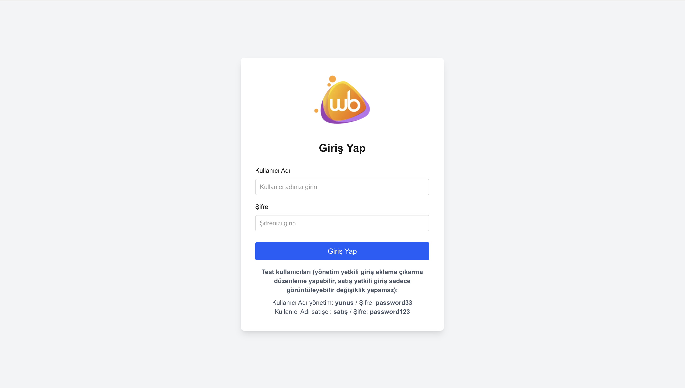
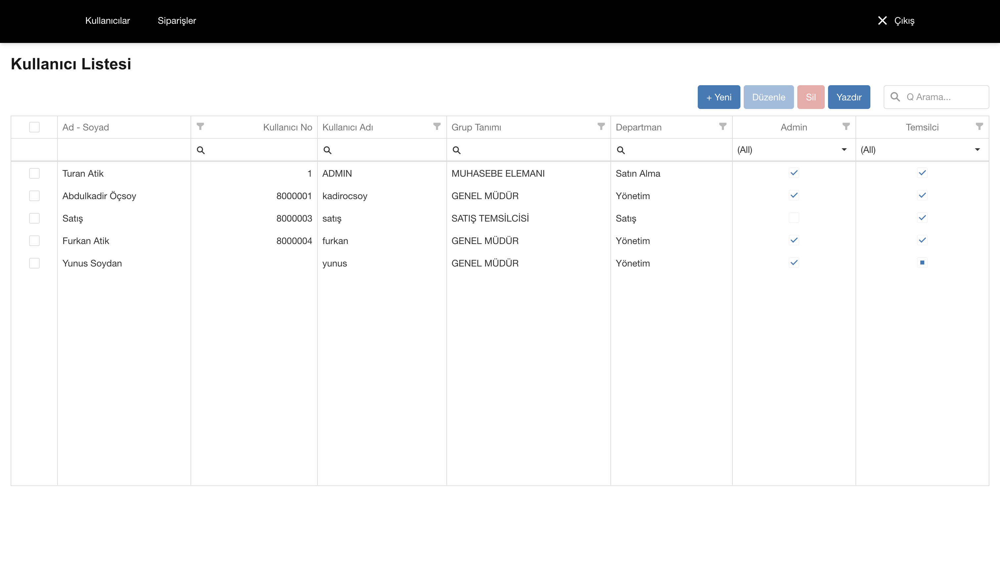
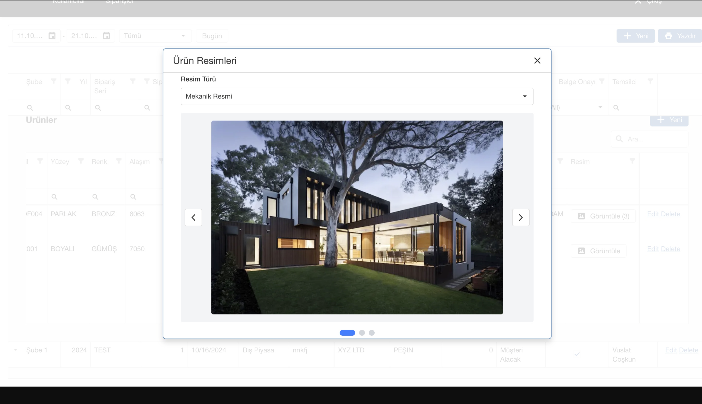
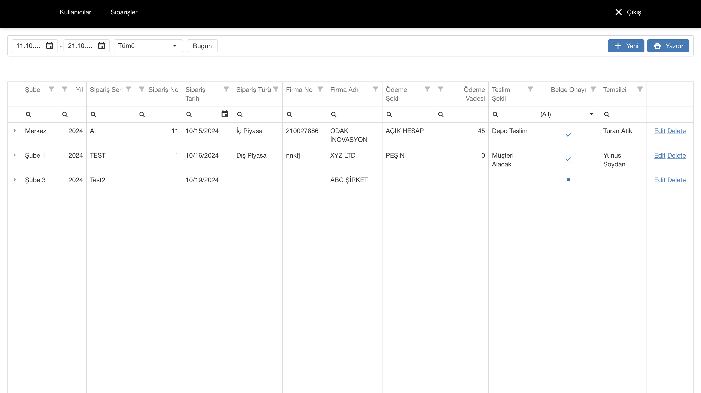
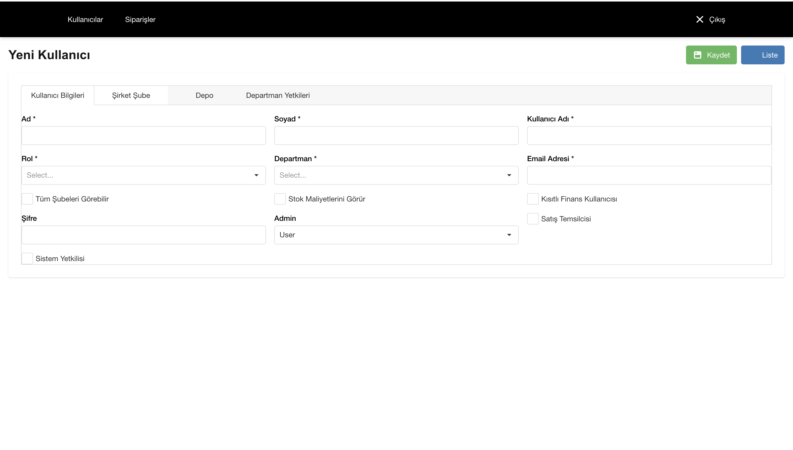

# Next.js DevExpress CRUD Application

Modern bir kullanıcı ve sipariş yönetim sistemi. Next.js 14, DevExpress DataGrid ve TypeScript ile geliştirilmiştir.

## Özellikler

- 🔐 Kullanıcı kimlik doğrulama sistemi
- 👥 Kullanıcı yönetimi (CRUD işlemleri)
- 📦 Sipariş yönetimi
- 🖼️ Ürün resim yönetimi
- 🔒 Rol tabanlı yetkilendirme (Yönetim/Satış)
- 📊 DevExpress DataGrid ile gelişmiş tablo özellikleri
- 🎨 Modern ve responsive UI

## Ekran Görüntüleri







## Teknolojiler

- **Next.js 14** - React framework
- **TypeScript** - Type safety
- **DevExpress React** - DataGrid ve UI components
- **Tailwind CSS** - Styling
- **js-cookie** - Cookie management

## Kurulum

1. Repository'yi klonlayın:
```bash
git clone https://github.com/Yunussoydan33/NextDevExpress.git
cd NextDevExpress
```

2. Bağımlılıkları yükleyin:
```bash
npm install
```

3. Geliştirme sunucusunu başlatın:
```bash
npm run dev
```

4. Tarayıcınızda [http://localhost:3000](http://localhost:3000) adresini açın.

## Test Kullanıcıları

### Yönetim Yetkili
- **Kullanıcı Adı:** `yunus`
- **Şifre:** `password33`
- **Yetkiler:** Tüm CRUD işlemleri (ekleme, düzenleme, silme)

### Satış Yetkili
- **Kullanıcı Adı:** `satış`
- **Şifre:** `password123`
- **Yetkiler:** Sadece görüntüleme (değişiklik yapamaz)

## Proje Yapısı

```
├── app/
│   ├── api/              # API routes
│   ├── login/            # Giriş sayfası
│   ├── users/            # Kullanıcı yönetimi
│   └── orders/           # Sipariş yönetimi
├── components/            # React components
├── data/                  # JSON veri dosyaları
├── lib/                   # Utility functions
└── public/                # Static dosyalar
```

## Özellikler Detayı

### Kullanıcı Yönetimi
- Kullanıcı listesi görüntüleme
- Yeni kullanıcı ekleme
- Kullanıcı düzenleme
- Kullanıcı silme (çoklu seçim)
- Filtreleme ve arama
- Export özelliği

### Sipariş Yönetimi
- Sipariş listesi görüntüleme
- Tarih aralığı filtreleme
- Temsilci bazlı filtreleme
- Master-Detail görünümü (sipariş-ürün ilişkisi)
- Ürün resim yönetimi

### Yetkilendirme
- Rol tabanlı erişim kontrolü
- Yönetim departmanı: Tüm işlemler
- Satış departmanı: Sadece görüntüleme

## Geliştirme

```bash
# Development server
npm run dev

# Production build
npm run build

# Start production server
npm start

# Linting
npm run lint
```

## Lisans

Bu proje [MIT License](LICENSE) altında lisanslanmıştır.

Copyright (c) 2025 Yunus Emre Soydan

## İletişim

**Yunus Emre Soydan**
- GitHub: [@Yunussoydan33](https://github.com/Yunussoydan33)
- Email: yunussoydan@gmail.com

---

⭐ Bu projeyi beğendiyseniz yıldız vermeyi unutmayın!
